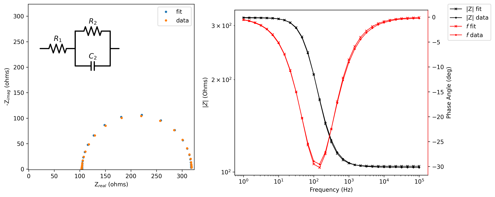
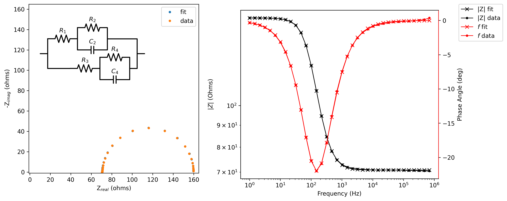
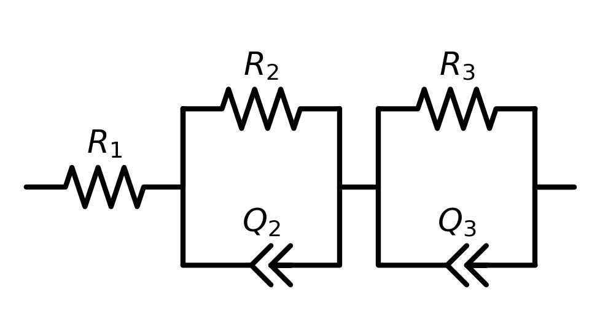

For this project, (Brief Project Description)

 

---

# Project 5: Electrochemical Impedance Spectroscopy
### Tanner Leo, University of Oregon, Electrochemistry Lab, December 11th

## 1 Introduction
Electrochemical impedance spectroscopy (EIS) is a powerful analytical method for probing electrochemical systems. While most analytical electrochemical experimental techniques involve passing direct current (DC) through a cell, EIS passes alternating current (AC) through a cell. Electrochemical cells can often be modeled in terms of simple electronic circuits, composed of capacitors and resistors. The capacitors and resistors in an equivalent electronic circuit can be understood as representations of the different capacitive and resistive elements in the electrochemical cell, such as the double layer capacitance at each electrode, the resistance of charge transfer, or the total ohmic resistance of the cell.[1](#bard)

Figure 1 below shows a simple Randles circuit, consisting of a resistor in series with a parallel circuit of a resistor and a capacitor. This circuit is the most simplified version of an equivalent circuit representing a single electrode-electrolyte interface.[2](#pine) The Rs represents the solution resistance, or the total ohmic resistance of the cell including the resistivity of the electrolyte, and the resistance in the wires leading from the potentiostat. The molarity of the salt solution can play a role on the solution resistance. The Rct represents the charge transfer resistance. Depending on the kinetics of the electrochemical reaction, the charge transfer resistance can be very small or very large. This charge transfer resistance is in parallel with Cdl, which represents the double layer at the electrode-electrolyte interface. If the electrode-electrolyte interface is different at the counter electrode and working electrode, a modification to this circuit would be to include two parallel Rct &ndash; Cdl elements in series. To include diffusion, a Warburg impedance element would be added in series with Rct. Equivalent circuits for electrochemical systems can become increasingly complex with the addition of more circuit elements and increasingly harder to interpret. However, complex equivalent circuits are used for achieving a better fit to the data due to a number of non-idealities that prevent electrochemical systems from being represented as simple linear circuits.[3](#stock) 

 

    

    
    

     
    <i>
        <b>Figure 1.</b> Simple Randles Circuit. Labels Rs, Rct, and dl refer to the solution resistance, charge transfer resistance, and double layer capacitance respectively. Image from Pine Instruments.<a href=#pine>2</a>
    </i>

 

EIS is able to probe electrochemical systems represented by a number of simple circuit elements due to the relationship some of these circuit elements have with time. When a system is perturbed using AC currents, the relationship between E and i is described as a function of frequency, and is called the impedance, $Z$. For example, a capacitor will present a different impedance depending on the frequency. Equation 1 below defines the impedance of a capacitor. 

\begin{equation}
\ Z = \frac {1}{j\omega C}
\tag{1}
\end{equation}

Where $j = \sqrt{-1}$, $\omega$ is frequency in rad/s, and $C$ is the capacitance as $\frac Q V$, or charge of potential difference. The impedance of a capacitor, therefore, is a complex number and can be represented on a complex plane. A typical plot used to represent impedance spectrums is the Nyquist plot: negative imaginary impedance plotted against real impedance, where both axes are given the same scale.[1](#bard)

EIS can be used to experimentally measure physical quantities that describe the electrochemical system, such as the the solution resistance, charge transfer resistance, and double layer capacitance as mentioned previously. However, many more applications exist for EIS in the different fields of electrochemistry. For example, novel techniques have been used to determine the state of charge (SoC) for lithium ion batteries based on EIS.[4](#shoa) As lithium ion batteries become more understood, values such as the charge transfer resistance can be tied to physical changes within the cell, such as the thickening of the solid electrolyte interface (SEI).[5](#wang)

## 2 Experimental 
### 2.1 Simple Circuit Elements
A number of different simple circuit elements were subjected to potential controlled EIS experiments. For each circuit tested, the frequency was swept from 1 MHz to 0.1 Hz with 6 points collected per decade. The oscillation amplitude was 10 mV.

The circuits which were tested included a resistor, a capacitor, a resistor in series with a capacitor, a resistor in parallel with a capacitor, a Randles circuit, and two Randles circuits in parallel. The data collected was fit to the equivalent circuits in Python, and the values for the circuit elements were determined. 

### 2.2 Lithium Ion Battery EIS

A secondary lithium ion coin cell (LIR2032) was subjected to potential-controlled EIS experiments at various states of charge. The coin cell was a Lithium Cobalt Oxide type battery. The cell started in the discharged state, with a potential of 2.714 V between the anode and the cathode. The cell was charged using a constant current (CC) of 40 mA for intervals of 10 minutes. A condition was set so that the potential would not exceed 4.20 V. In between the CC intervals, EIS measurements were taken of the cell, immediately after the CC cycle stopped, and about 70 seconds after the EIS measurement had stopped. After this procedure was repeated 8 times, a constant potential of 4.20 V was applied until the current was below 2 mA. Due to a mistake in the setup of the constant potential step, this step stopped after 5 minutes when the current was 20 mA. The EIS measurements were conducted over a range of frequencies from 7 MHz to 0.1 Hz, with an amplitude of 10 mV.

## 3 Results
### 3.1 Simple Circuit Elements

A 100 &Omega; resistor was subjected to an EIS experiment, and the Nyquist plot is shown in Figure 2 below. The impedance is entirely real, and exists at 100 &Omega;.

 

    
     
    <i>
        <b>Figure 2.</b> Nyquist Plot of a 100 &Omega; resistor.
    </i>

 

Figure 3 shows a Nyquist plot of a 100 &Omega; resistor in series with a 10 &mu;F capacitor. The data was fit to this simple circuit, and $C$ was found to be 10.15 &mu;F and $R$ was found to be 107.2 &Omega;.

 

    
     
    <i>
        <b>Figure 3.</b> Nyquist Plot of a 10 &mu;F capacitor in series with a 100 &Omega; resistor.
    </i>

 

Figure 4 below shows the data collected for a Randles circuit, where $R_1 = 100\ \Omega$, $R_2 = 220 \ \Omega$, and $C_2 = 10\ \mu F$. The data was fit to an equivalent circuit and $R_1$ was found to be 104 &Omega;, $R_2$ to be 214 &Omega;, and $C_2$ to be 9.94 &mu;F.

 

    
     
    <i>
        <b>Figure 4.</b> Nyquist plot (left) and Bode plot (right) of a Randle's circuit with a 100 &Omega; resistor in series with a parallel 10 &mu;F capacitor and 220 &Omega; resistor.
    </i>

 

Figure 5 below shows the same circuit, although this time with $R_1 = 10\ \Omega$, $R_2 = 330 \ \Omega$, and $C_2 = 1000\ pF$. The data was fit to the equivalent circuit, and $R_1$ was found to be 14.5 &Omega;, $R_2$ to be 324 &Omega;, and $C_2$ to be 947 pF.

 

       
     
    <i>
        <b>Figure 5.</b> Nyquist plot (left) and Bode plot (right) of a Randles circuit with a 10 &Omega; resistor in series with a parallel 1000 pF capacitor and 330 &Omega; resistor.
    </i>

 

Figure 6 below displays a Bode plot comparing the two Randles circuits presented in Figures 4 and 5 above. The peaks in phase angle occur at different frequencies, and the changes in absolute impedance occur to different extents. The impedance data collected for the Randles circuit 1 wasn't collected over a large enough range to fully show the high frequency limit of the absolute impedance. The high frequency limits coincide with the impedance of the series resistor. The Randles circuit 1 also shows a peak in phase angle which has greater overall magnitude. This is due to ratio of $R_1$ to $R_2$ in these circuits. Since the ratio is larger with the circuit elements in Figure 5 than in Figure 4, the magnitude of this phase angle peak is larger.

    
     
    <i>
        <b>Figure 6.</b> Bode plot the two Randles circuits shown in Figure 4 and Figure 5. Randles 1 corresponds with the circuit shown in Figure 5 while Randles 2 corresponds with the circuit shown in Figure 4.
    </i>

 

Figure 7 below shows the Nyquist plot and the fitted data for two parallel randles circuits, from Figure 4 and Figure 5 above. The achieved fit appears to agree with the collected data. The actual and measured parameters are shown in Table 1 below.

 

    
     
    <i>
        <b>Figure 7.</b> Nyquist plot (left) and Bode plot (right) of two parallel Randles circuits each having unique resistors and capacitors. 
    </i>

 

<b>Table 1.</b> Actual and Fitted Circuit Element Parameters for Randles Circuits in Figure 7

| Parameters | R1 (&Omega;) | R2 (&Omega;) | R3 (&Omega;) | R4 (&Omega;) | C2 (&mu;F) | C4 (pF) |
| ---------- | --------------- | --------------- | --------------- | --------------- | -------------- | ----------- |
| Actual     | 100             | 220             | 10              | 330             | 10             | 1000        |
| Fitted     | 103             | 204             | 20              | 335             | 10             | 933         |

 

Figure 8 below shows the Nyquist plot and the fitted data for two parallel randles circuits, where the resistors $R_1$ and $R_3$ were given the same value, and $R_2$ and $R_4$ were also made the same. The actual and fitted values for the circuit elements are shown in Table 2 below. Again, there is good agreement between the fit and the measured data. 

 

    
     
    <i>
        <b>Figure 8.</b> Nyquist plot (left) and Bode plot (right) of two parallel Randles circuits where each circuit has a 100 &Omega; series resistor and a 220 &Omega; parallel resistor, and two different capacitors.
    </i>

 

<b>Table 2.</b> Actual and Fitted Circuit Element Parameters for Randles Circuits in Figure 8

| Parameters | R1 (&Omega;) | R2 (&Omega;) | R3 (&Omega;) | R4 (&Omega;) | C2 (&mu;F) | C4 (pF) |
| ---------- | --------------- | --------------- | --------------- | --------------- | -------------- | ----------- |
| Actual     | 100             | 220             | 100             | 220             | 10             | 1000        |
| Fitted     | 97.5            | 170             | 124             | 273             | 11             | 1100        |

Figure 9 below shows the Nyquist plot and the fitted data for two parallel randles circuits, where the resistors $R_1$ and $R_4$ were made the same and $R_2$ and $R_3$ were made the same, the both capacitors were 10 &mu;F. The actual and fitted values for the circuit elements are shown in Table 3 below. 

 

    
     
    <i>
        <b>Figure 9.</b> Nyquist plot (left) and Bode plot (right) of two parallel Randles circuits where both share the same capacitor. 
    </i>

 

<b>Table 3.</b> Actual and Fitted Circuit Element Parameters for Randles Circuits in Figure 9

| Parameters | R1 (&Omega;) | R2 (&Omega;) | R3 (&Omega;) | R4 (&Omega;) | C2 (&mu;F) | C4 (&mu;F) |
| ---------- | --------------- | --------------- | --------------- | --------------- | -------------- | -------------- |
| Actual     | 220             | 100             | 100             | 220             | 10             | 10             |
| Fitted     | 212             | 168             | 106             | 169             | 4.3            | 12             |

Figure 10 below shows a Nyquist plot for a Randles circuit with two parallel elements in series, as shown on the plot. The actual and fitted values for the circuit elements are shown in Table 4 below. The two separate semi-circles associated with the two separate RC time constants are difficult to separate on the Nyquist plot. 

 

    
     
    <i>
        <b>Figure 10.</b> Nyquist plot (left) and Bode plot (right) of two series Randles circuits where both share the same capacitor and one randles circuit has a resistor 10x larger than the other. 
    </i>

 

<b>Table 4.</b> Actual and Fitted Circuit Element Parameters for Randles Circuits in Figure 10

| Parameters | R1 (&Omega;) | R2 (&Omega;) | R3 (&Omega;) | C2 (&mu;F) | C3 (&mu;F) |
| ---------- | --------------- | --------------- | --------------- | -------------- | -------------- |
| Actual     | 10              | 1000            | 10K             | 10             | 10             |
| Fitted     | 17              | 984             | 9.54K           | 9.3            | 10             |

### 3.2 Lithium Ion Battery EIS

A secondary lithium ion coin cell was subjected to multiple short charging cycles where 40 mA was applied, followed by a step where the potential was held at 4.20 V. Figure 11 below shows the potential response during these CC cycles. 

 

    
     
    <i>
        <b>Figure 11.</b> Plot of potential vs time for battery constant current charging. 
    </i>

 

Figure 12 below shows the Nyquist plots for the different measurements taken while the cell was being charged. The shape of the Nyquist curve evolves from the first cycle to the last cycle from red to orange and lastly to blue. 

 

    
     
    <i>
        <b>Figure 12.</b> Nyquist plot for the PEIS measurements taken at different times during charging. 
    </i>

 

Figure 13 below shows the circuit used to fit the impedance data. The Q represents a pseudo capacitor, which has impedance given by equation 2 below. 

\begin{equation}
Z = \frac {R}{R Q (j\omega)^a + 1}
\tag{2}
\end{equation}

Where $Q$ has units of F&centerdot;s(a-1). 

 

    
     
    <i>
        <b>Figure 13.</b> Circuit used to fit the coin cell impedance data.  
    </i>

 

Figure 14 below shows the results of the EIS impedance data fits. All of the fitted parameters are given in Appendix A. All the fits yielded good residuals, and the R2 value adjusted to the number of fitted variables was above 0.976 in all cases. The values for $R_3$, $Q_2$, and $Q_3$ all appear to decrease from the first PEIS spectrum to the last. $R_2$ appears to increase initially, contrary to the other parameters. However, at long times, both $R_2$ and $Q_2$ decrease as the cell continues charging, while $R_3$ and $Q_3$ increase at long times. It is clear that as the cell begins to become more charged, $R_2$ and $R_3$ become more similar, as well as $Q_2$ and $Q_3$. As seen on the inset plot, $a^2$ and $a^3$ also become more similar as the cell becomes more charged.

 

    
     
    <i>
        <b>Figure 14.</b> Plot of the different fitting parameters found for the PEIS measurements taken at different times. 
    </i>

 

In addition to the value of the fitted parameters, the change in absolute value of the parameters between the first and second PEIS measurement was analyzed. According to Messing,[4](#shoa) the health of the battery can be understood through the change in the various circuit parameters over the rest period in between PEIS measurements. Figure 15 below shows the difference between fitting parameters before and after a rest period, normalized to the minimum value of the parameter for a given cycle. As expected, $R_1$ changes the least of all the parameters across the time spent charging, and appears to be relatively stable. $R_3$ and $Q_3$ show clear increases in the different before and after the rest period, although for the last two data points this difference becomes smaller again. All the parameters appear to show a spike around 57 minutes. This time also correspond with the poorest impedance fit of the data.

 

    
     
    <i>
        <b>Figure 15.</b> Plot of the relative difference between PEIS fitting parameters before and after a rest period. 
    </i>

  

Lastly, the exchange current associated with the SEI and cathode electrolyte interface (CEI) were calculated assuming a 1 electron transfer, and ambient temperature of 25 &deg;C. The results are shown in Figure 16. Since the concentrations within the cell were not determined, the standard rate constant was not determined. The SEI was identified from $R_3$, since $R_3$ appeared to increase as the cell is charged. The SEI is known to become thicker as the cell is charged, and the value of k0 is known to decrease as this happens.[5](#wang)

 

    
     
    <i>
        <b>Figure 16.</b> Plot of the exchange current of the solid electrolyte interface and cathode electrolyte interface as a function of time.
    </i>

  

## Discussion 
### 4.1 Simple Circuit Elements

<!-- 
**Questions**<mark>
5.	Under what conditions is it possible to resolve individual circuit elements within an equivalent circuit that contains multiple Randles-type circuits?</mark> -->

Individual circuit elements were only able to be resolved visually on the Nyquist plots when their RC time constants were sufficiently different. For example, the two parallel Randles circuits in Figures 7 and 8 had RC time constant ratios of 6.6&times;103 and 1&times;104, and the two semicircles on the Nyquist plots were clearly resolvable. Contrarily, the RC time constant ratios in Figure 9 and 10 were 2.2 and 10, and only one semicircle could clearly be resolved.

### 4.2 Lithium Ion Battery EIS
The equivalent circuit was chosen for the coin cell impedance data based on it's simplicity, and it's relevancy to the system being studied. Since diffusion will not play a big role, a Warburg impedance element was not included.[1](#bard) Induction was also assumed to be small, so this element was excluded from the circuit. Lastly, this simple Randles circuit with pseudo-capacitive elements was found to obtain the best fit to the data. 

The changes in fitting parameters were analyzed by measuring EIS spectra before and after a wait period during charging. The results shown in Figure 15 suggested that the difference in parameters $R_3$ and $Q_3$ were clearly trending in one direction. However, this analysis involved taking the absolute value of the change in the parameter. Many of the differences between the parameters before and after the wait cycle were negative. The difference between the parameters was likely due to error in fitting or error from noise in the data; meaningful trends cannot be extracted from this data. However, if a longer rest period in between EIS measurements was implemented, a clearer trend may have been observed. Additionally, the method of analysis performed by Messing and Shoa utilized discharging pulses instead of charging current as a preconditioning to the measured EIS spectra.[4](#shoa) This difference in methods may have also lead to the method of analysis being invalid in this case. 

The actual values of the circuit elements did show meaningful trends across the time spent charging, when taken as their actual values (Figure 14). There was a clear trend in all of the circuit elements and fitting parameters. From this data, using knowledge of the SEI and CEI layer thicknesses and properties as the evolve of the range of cell potentials, the circuit elements associated with the SEI were be determined to be $R_3$, $Q_3$, and $a_3$. This was supported by the analysis of the exchange current (Figure 16). However, the first impedance cycle showed values which were not aligned with these trends. This could be due to a process of the initial lithiation of the cathode that occurs during the first charging cycle.[6](#zhang) After lithium is inserted into the SEI, the ionic conductivity rises dramatically, causing a decrease in the resistance in this half of the cell.

## References

 (1) Bard, A. J.; Faulkner, L. R.; White, H. S. Electrochemical Methods: Fundamentals and Applications, Third edition.; Wiley: Hoboken, NJ, 2022.
 

 (2) Electrochemcal Impedance Spectroscopy (EIS) Basics. Pine Research Instrumentation Store. https://pineresearch.com/shop/kb/theory/eis-theory/eis-basics/ (accessed 2022-12-10).
 

 (3) Haeverbeke, M. V.; Stock, M.; De Baets, B. Equivalent Electrical Circuits and Their Use Across Electrochemical Impedance Spectroscopy Application Domains. IEEE Access 2022, 10, 51363–51379. https://doi.org/10.1109/ACCESS.2022.3174067.
 
 
 (4) Messing, M.; Shoa, T.; Habibi, S. Estimating Battery State of Health Using Electrochemical Impedance Spectroscopy and the Relaxation Effect. Journal of Energy Storage 2021, 43, 103210. https://doi.org/10.1016/j.est.2021.103210.
 

 (5) Wang, A.; Kadam, S.; Li, H.; Shi, S.; Qi, Y. Review on Modeling of the Anode Solid Electrolyte Interphase (SEI) for Lithium-Ion Batteries. npj Comput Mater 2018, 4 (1), 1–26. https://doi.org/10.1038/s41524-018-0064-0.

 (6) Zhang, S. S.; Xu, K.; Jow, T. R. EIS Study on the Formation of Solid Electrolyte Interface in Li-Ion Battery. Electrochimica Acta 2006, 51 (8–9), 1636–1640. https://doi.org/10.1016/j.electacta.2005.02.137.

# Appendix A

| order       | cycle  | R1 (&Omega;) | Q2 (F&centerdot;s(a-1)) | R2 (&Omega;) | Q3 (F&centerdot;s(a-1)) | R3 (&Omega;) | a2 | a3 | $R^2$  | t         | OCV    |
| ----------- | ------ | ------------ | ---------------------------------- | ------------ | ---------------------------------- | ------------ | ------------- | ------------- | ------ | --------- | ------ |
| before wait | 1.0000 | 1.2785       | 0.1884                             | 0.6712       | 0.0161                             | 87.7042      | 0.3457        | 0.6882        | 0.9986 | 2.0395    | 2.7148 |
| after wait  | 1.0000 | 1.2482       | 0.2013                             | 0.7434       | 0.0161                             | 85.4320      | 0.3386        | 0.6902        | 0.9987 | 76.2151   | 2.7151 |
| before wait | 2.0000 | 0.9676       | 0.0336                             | 3.0405       | 0.0005                             | 0.0508       | 0.5478        | 1.0000        | 0.9925 | 716.8405  | 3.7546 |
| after wait  | 2.0000 | 0.9669       | 0.0341                             | 3.0768       | 0.0006                             | 0.0481       | 0.5450        | 1.0000        | 0.9922 | 788.0233  | 3.7486 |
| before wait | 3.0000 | 1.0388       | 0.0323                             | 2.5059       | 0.0005                             | 0.0673       | 0.5617        | 1.0000        | 0.9920 | 1428.9279 | 3.7476 |
| after wait  | 3.0000 | 1.0320       | 0.0295                             | 2.5463       | 0.0006                             | 0.0785       | 0.5782        | 0.9787        | 0.9956 | 1498.8147 | 3.8133 |
| before wait | 4.0000 | 1.0019       | 0.0277                             | 2.1794       | 0.0012                             | 0.1025       | 0.5956        | 0.8954        | 0.9948 | 2140.3552 | 3.8117 |
| after wait  | 4.0000 | 1.0025       | 0.0250                             | 2.2093       | 0.0017                             | 0.1238       | 0.6162        | 0.8505        | 0.9975 | 2210.2451 | 3.8707 |
| before wait | 5.0000 | 1.0277       | 0.0237                             | 1.8019       | 0.0058                             | 0.1947       | 0.6465        | 0.7133        | 0.9930 | 2851.7867 | 3.8690 |
| after wait  | 5.0000 | 1.0315       | 0.0225                             | 1.9346       | 0.0034                             | 0.1681       | 0.6456        | 0.7692        | 0.9984 | 2921.4284 | 3.9397 |
| before wait | 6.0000 | 0.9801       | 0.0333                             | 1.3135       | 0.0343                             | 0.4571       | 0.6694        | 0.5258        | 0.9767 | 3430.1682 | 3.9380 |
| after wait  | 6.0000 | 1.0091       | 0.0223                             | 1.7518       | 0.0042                             | 0.1894       | 0.6574        | 0.7456        | 0.9987 | 3499.8090 | 4.0080 |
| before wait | 7.0000 | 1.0145       | 0.0225                             | 1.6860       | 0.0069                             | 0.2214       | 0.6642        | 0.6925        | 0.9962 | 3622.4498 | 4.0050 |
| after wait  | 7.0000 | 1.0153       | 0.0217                             | 1.7770       | 0.0042                             | 0.1891       | 0.6603        | 0.7448        | 0.9989 | 3692.2226 | 4.0193 |
| before wait | 8.0000 | 1.0175       | 0.0227                             | 1.7797       | 0.0034                             | 0.1741       | 0.6492        | 0.7689        | 0.9977 | 3788.2958 | 4.0157 |
| after wait  | 8.0000 | 1.0135       | 0.0214                             | 1.7885       | 0.0044                             | 0.1928       | 0.6628        | 0.7401        | 0.9990 | 3858.0666 | 4.0253 |

